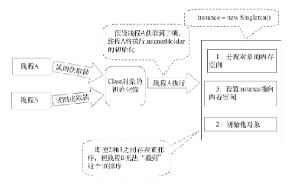

<!-- START doctoc generated TOC please keep comment here to allow auto update -->
<!-- DON'T EDIT THIS SECTION, INSTEAD RE-RUN doctoc TO UPDATE -->


- [单例模式](#%E5%8D%95%E4%BE%8B%E6%A8%A1%E5%BC%8F)
  - [饿汉模式](#%E9%A5%BF%E6%B1%89%E6%A8%A1%E5%BC%8F)
  - [双重检查锁定](#%E5%8F%8C%E9%87%8D%E6%A3%80%E6%9F%A5%E9%94%81%E5%AE%9A)
  - [静态内部类](#%E9%9D%99%E6%80%81%E5%86%85%E9%83%A8%E7%B1%BB)
- [装饰模式](#%E8%A3%85%E9%A5%B0%E6%A8%A1%E5%BC%8F)
- [适配器模式](#%E9%80%82%E9%85%8D%E5%99%A8%E6%A8%A1%E5%BC%8F)
- [观察者模式](#%E8%A7%82%E5%AF%9F%E8%80%85%E6%A8%A1%E5%BC%8F)
- [代理模式](#%E4%BB%A3%E7%90%86%E6%A8%A1%E5%BC%8F)
  - [静态代理](#%E9%9D%99%E6%80%81%E4%BB%A3%E7%90%86)
  - [动态代理](#%E5%8A%A8%E6%80%81%E4%BB%A3%E7%90%86)
    - [JDK动态代理](#jdk%E5%8A%A8%E6%80%81%E4%BB%A3%E7%90%86)
- [工厂模式](#%E5%B7%A5%E5%8E%82%E6%A8%A1%E5%BC%8F)
  - [简单工厂模式](#%E7%AE%80%E5%8D%95%E5%B7%A5%E5%8E%82%E6%A8%A1%E5%BC%8F)
  - [工厂方法模式](#%E5%B7%A5%E5%8E%82%E6%96%B9%E6%B3%95%E6%A8%A1%E5%BC%8F)
  - [抽象工厂模式](#%E6%8A%BD%E8%B1%A1%E5%B7%A5%E5%8E%82%E6%A8%A1%E5%BC%8F)
- [模板模式](#%E6%A8%A1%E6%9D%BF%E6%A8%A1%E5%BC%8F)
- [建造者模式](#%E5%BB%BA%E9%80%A0%E8%80%85%E6%A8%A1%E5%BC%8F)

<!-- END doctoc generated TOC please keep comment here to allow auto update -->

## 单例模式

需要对实例字段使用线程安全的延迟初始化，使用双重检查锁定的方案；需要对静态字段使用线程安全的延迟初始化，使用静态内部类的方案。

### 饿汉模式

```
public class Singleton {  
    private static Singleton instance = new Singleton();  
    private Singleton() {}  
    public static Singleton newInstance() {
        return instance;  
    }  
}
```
JVM在类的初始化阶段，会执行类的静态方法。在执行类的初始化期间，JVM会去获取Class对象的锁。这个锁可以同步多个线程对同一个类的初始化。

饿汉模式只在类加载的时候创建一次实例，没有多线程同步的问题。单例没有用到也会被创建，而且在类加载之后就被创建，内存就被浪费了。

### 双重检查锁定

instance使用static修饰的原因：getInstance为静态方法，因为静态方法的内部不能直接使用非静态变量，只有静态成员才能在没有创建对象时进行初始化，所以返回的这个实例必须是静态的。

```
public class Singleton {  
    private static volatile Singleton instance = null;  //volatile
    private Singleton(){}  
    public static Singleton getInstance() {  
        if (instance == null) {  
            synchronized (Singleton.class) {  
                if (instance == null) {
                    instance = new Singleton();  
                }  
            }  
        }  
        return instance;  
    }  
}  
```
为什么两次判断`instance == null`：

| Time | Thread A             | Thread B             |
| ---- | -------------------- | -------------------- |
| T1   | 检查到`instance`为空 |                      |
| T2   |                      | 检查到`instance`为空 |
| T3   |                      | 初始化对象`A`        |
| T4   |                      | 返回对象`A`          |
| T5   | 初始化对象`B`        |                      |
| T6   | 返回对象`B`          |                      |

`new Singleton()`会执行三个动作：分配内存空间、初始化对象和对象引用指向内存地址。

```java
memory = allocate();　　// 1：分配对象的内存空间
ctorInstance(memory);　 // 2：初始化对象
instance = memory;　　  // 3：设置instance指向刚分配的内存地址
```

由于指令重排优化的存在，导致初始化对象和将对象引用指向内存地址的顺序是不确定的。在某个线程创建单例对象时，会为该对象分配了内存空间并将对象的字段设置为默认值。此时就可以将分配的内存地址赋值给instance字段了，然而该对象可能还没有初始化。若紧接着另外一个线程来调用getInstance，取到的是未初始化的对象，程序就会出错。volatile 可以禁止指令重排序，保证了先初始化对象再赋值给instance变量。

| Time | Thread A                 | Thread B                                 |
| :--- | :----------------------- | :--------------------------------------- |
| T1   | 检查到`instance`为空     |                                          |
| T2   | 获取锁                   |                                          |
| T3   | 再次检查到`instance`为空 |                                          |
| T4   | 为`instance`分配内存空间 |                                          |
| T5   | 将`instance`指向内存空间 |                                          |
| T6   |                          | 检查到`instance`不为空                   |
| T7   |                          | 访问`instance`（此时对象还未完成初始化） |
| T8   | 初始化`instance`         |                                          |

### 静态内部类

```
public class Instance {
    private static class InstanceHolder {
        public static Instance instance = new Instance();
    }
    private Instance() {}
    public static Instance getInstance() {
        return InstanceHolder.instance ;　　// 这里将导致InstanceHolder类被初始化
    }
}
```
它与饿汉模式一样，也是利用了类初始化机制，因此不存在多线程并发的问题。不一样的是，它是在内部类里面去创建对象实例。这样的话，只要应用中不使用内部类，JVM就不会去加载这个单例类，也就不会创建单例对象，从而实现懒汉式的延迟加载。也就是说这种方式可以同时保证延迟加载和线程安全。



基于类初始化的方案的实现代码更简洁。但基于volatile的双重检查锁定的方案有一个额外的优势：除了可以对静态字段实现延迟初始化外，还可以对实例字段实现延迟初始化。字段延迟初始化降低了初始化类或创建实例的开销，但增加了访问被延迟初始化的字段的开销。在大多数时候，正常的初始化要优于延迟初始化。

[参考：单例模式](https://blog.csdn.net/goodlixueyong/article/details/51935526)


## 装饰模式
装饰模式以对客户端透明的方式拓展对象的功能，客户端并不会觉得对象在装饰前和装饰后有什么不同。装饰模式可以在不创造更多子类的情况下，将对象的功能加以扩展。

```
InputStream in = new LowerCaseInputStream(
                                        new  BufferedInputStream(
                                         new  FileInputStream("test.txt")));
```
设置FileInputStream，先用BufferedInputStream装饰它，再用自己写的LowerCaseInputStream过滤器去装饰它。

在装饰模式中的角色有：
抽象组件(Component)角色：给出一个抽象接口，以规范准备接收附加责任的对象。
具体组件(ConcreteComponent)角色：定义一个将要接收附加责任的类。
装饰(Decorator)角色：持有一个构件(Component)对象的实例，并定义一个与抽象构件接口一致的接口。
具体装饰(ConcreteDecorator)角色：负责给构件对象“贴上”附加的责任。


## 适配器模式
将现成的对象通过适配变成我们需要的接口。
适配器模式有类的适配器模式和对象的适配器模式两种不同的形式。

对象适配器模式通过组合对象进行适配。


类适配器通过继承来完成适配。


适配器模式的优点

1. 更好的复用性。系统需要使用现有的类，而此类的接口不符合系统的需要。那么通过适配器模式就可以让这些功能得到更好的复用。
2. 更好的扩展性。在实现适配器功能的时候，可以调用自己开发的功能，从而自然地扩展系统的功能。    

## 观察者模式
多个观察者对象同时监听某一个主题对象。这个主题对象在状态上发生变化时，会通知所有观察者对象，使它们能够自动更新自己。其作用是让主题对象和观察者松耦合。

观察者模式所涉及的角色有：
抽象主题(Subject)角色：抽象主题角色把所有对观察者对象的引用保存在一个聚集（比如ArrayList对象）里，每个主题都可以有任何数量的观察者。抽象主题提供一个接口，可以增加和删除观察者对象，抽象主题角色又叫做抽象被观察者(Observable)角色。
具体主题(ConcreteSubject)角色：将有关状态存入具体观察者对象；在具体主题的内部状态改变时，给所有登记过的观察者发出通知。具体主题角色又叫做具体被观察者(Concrete Observable)角色。
抽象观察者(Observer)角色：为所有的具体观察者定义一个接口，在得到主题的通知时更新自己，这个接口叫做更新接口。
具体观察者(ConcreteObserver)角色：存储与主题的状态自恰的状态。具体观察者角色实现抽象观察者角色所要求的更新接口，以便使本身的状态与主题的状态相协调。如果需要，具体观察者角色可以保持一个指向具体主题对象的引用。
Observer接口　Observable类
被观察者类都是java.util.Observable类的子类。

[观察者模式](https://www.cnblogs.com/luohanguo/p/7825656.html)


## 代理模式

代理模式使用代理对象完成用户请求，屏蔽用户对真实对象的访问。

### 静态代理

静态代理：代理类在编译阶段生成，程序运行前就已经存在，在编译阶段将通知织入Java字节码中。

缺点：因为代理对象需要与目标对象实现一样的接口，所以会有很多代理类。同时，一旦接口增加方法，目标对象与代理对象都要维护。

### 动态代理

动态代理：代理类在程序运行时创建，在内存中临时生成一个代理对象，在运行期间对业务方法进行增强。

#### JDK动态代理

JDK实现代理只需要使用newProxyInstance方法：

```java
static Object newProxyInstance(ClassLoader loader, Class<?>[] interfaces,   InvocationHandler h )
```

ClassLoader loader:指定当前目标对象使用的类加载器
Class<?>[] interfaces:目标对象实现的接口的类型
InvocationHandler h:当代理对象调用目标对象的方法时，会触发事件处理器的invoke方法()

```
public class DynamicProxyDemo {

    public static void main(String[] args) {
        //被代理的对象
        MySubject realSubject = new RealSubject();

        //调用处理器
        MyInvacationHandler handler = new MyInvacationHandler(realSubject);

        MySubject subject = (MySubject) Proxy.newProxyInstance(realSubject.getClass().getClassLoader(),
                realSubject.getClass().getInterfaces(), handler);

        System.out.println(subject.getClass().getName());
        subject.rent();
    }
}

interface MySubject {
    public void rent();
}
class RealSubject implements MySubject {

    @Override
    public void rent() {
        System.out.println("rent my house");
    }
}
class MyInvacationHandler implements InvocationHandler {

    private Object subject;

    public MyInvacationHandler(Object subject) {
        this.subject = subject;
    }

    @Override
    public Object invoke(Object object, Method method, Object[] args) throws Throwable {
        System.out.println("before renting house");
        //invoke方法会拦截代理对象的方法调用
        Object o = method.invoke(subject, args);
        System.out.println("after rentint house");
        return o;
    }
}
```


## 工厂模式
工厂模式是用来封装对象的创建。

### 简单工厂模式

只有一个工厂类。适用于需要创建的对象较少的场景。

```java
 public class ShapeFactory {
          public static final String TAG = "ShapeFactory";
          public static Shape getShape(String type) {
              Shape shape = null;
              if (type.equalsIgnoreCase("circle")) {
                  shape = new CircleShape();
              } else if (type.equalsIgnoreCase("rect")) {
                  shape = new RectShape();
              } else if (type.equalsIgnoreCase("triangle")) {
                  shape = new TriangleShape();
              }
              return shape;
          }
   }
```

优点：只需要一个工厂创建对象，代码量少。

缺点：系统扩展困难，新增产品需要修改工厂逻辑，当产品较多时，会造成工厂逻辑过于复杂，不利于系统扩展和维护。

### 工厂方法模式

针对不同的对象提供不同的工厂。每个对象都有一个与之对应的工厂。

```java
public interface Reader {
    void read();
}

public class JpgReader implements Reader {
    @Override
    public void read() {
        System.out.print("read jpg");
    }
}

public class PngReader implements Reader {
    @Override
    public void read() {
        System.out.print("read png");
    }
}

public interface ReaderFactory {
    Reader getReader();
}

public class JpgReaderFactory implements ReaderFactory {
    @Override
    public Reader getReader() {
        return new JpgReader();
    }
}

public class PngReaderFactory implements ReaderFactory {
    @Override
    public Reader getReader() {
        return new PngReader();
    }
}
```

客户端通过子类来指定创建对应的对象。

```java
ReaderFactory factory=new JpgReaderFactory();
Reader  reader=factory.getReader();
reader.read();
```

优点：增加新的产品类时无须修改现有系统，只需增加新产品和对应的工厂类即可。

### 抽象工厂模式

多了一层抽象，减少了工厂的数量（HpMouseFactory和HpKeyboFactory合并为HpFactory）。


## 模板模式

在抽象类中定义一个操作中算法的骨架，子类按照需要重写方法实现。

```java
public abstract class DodishTemplate {    
    //模板
    protected void dodish(){
        this.preparation();
        this.doing();
        this.carriedDishes();
    }

    public abstract void preparation();

    public abstract void doing();

    public abstract void carriedDishes ();
}
```


## 建造者模式

传统建造者模式：

```java
public class Computer {
    private final String cpu;//必须
    private final String ram;//必须
    private final int usbCount;//可选
    private final String keyboard;//可选
    private final String display;//可选

    private Computer(Builder builder){
        this.cpu=builder.cpu;
        this.ram=builder.ram;
        this.usbCount=builder.usbCount;
        this.keyboard=builder.keyboard;
        this.display=builder.display;
    }
    public static class Builder{
        private String cpu;//必须
        private String ram;//必须
        private int usbCount;//可选
        private String keyboard;//可选
        private String display;//可选

        public Builder(String cup,String ram){
            this.cpu=cup;
            this.ram=ram;
        }
        public Builder setDisplay(String display) {
            this.display = display;
            return this;
        }       
        //set...
        public Computer build(){
            return new Computer(this);
        }
    }
}

public class ComputerDirector {
    public void makeComputer(ComputerBuilder builder){
        builder.setUsbCount();
        builder.setDisplay();
        builder.setKeyboard();
    }
}
```

传统建造者模式变种，链式调用：

```java
public class LenovoComputerBuilder extends ComputerBuilder {
    private Computer computer;
    public LenovoComputerBuilder(String cpu, String ram) {
        computer=new Computer(cpu,ram);
    }
    @Override
    public void setUsbCount() {
        computer.setUsbCount(4);
    }
	//...
    @Override
    public Computer getComputer() {
        return computer;
    }
}

Computer computer=new Computer.Builder("因特尔","三星")
                .setDisplay("三星24寸")
                .setKeyboard("罗技")
                .setUsbCount(2)
                .build();
```

